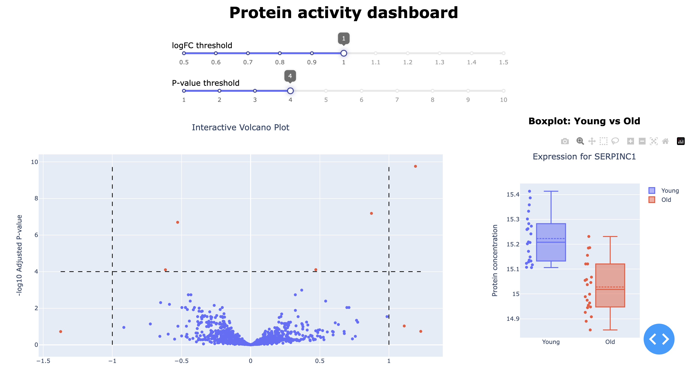
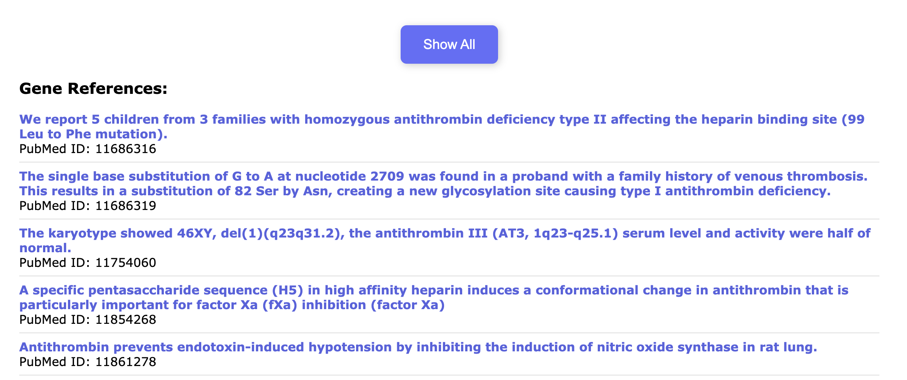

# Gene Knowledge Base Web Service

## Table of Contents

1. [Overview](#overview)  
2. [Project structure](#project-structure)
3. [Setup and Installation](#setup-and-installation)
4. [Usage](#usage)
5. [FAQ](#faq)
6. [Contacts](#contacts)

---

## Overview

This project provides a Flask-based web service to visualize differences in protein activity levels interactively, which includes:

   - an interactive volcano plot with clickable points to view boxplots
   - boxplots (Young vs. Old) with additional points representing the protein concentration value in each sample
   - scientific paper titles and URLs where the selected gene name was reported






---

## Project Structure

```bash
.
├── assets
│   └── style.css               # CSS file for styling
├── data
│   └── NIHMS1635539-supplement-1635539_Sup_tab_4.xlsx  
│       # Main Excel file containing:
│       # - "S4B limma results" sheet (for volcano plot data)
│       # - "S4A values" sheet (for boxplot data)
├── main.py                     # Main Flask + Dash application entry point
├── requirements.txt            # Python dependencies for the project
└── README.md
```

---

## Setup and Installation

1. **Clone the repository:**
```bash
git clone git@github.com:YaroslavMayorov/gene_knowledge.git
cd gene_knowledge
```

2. **Create a virtual environment:**
```bash
python3.10 -m venv venv
```

Linux / MacOs

```bash
source venv/bin/activate
```

Windows (Command Prompt (cmd.exe))

```bash
venv\Scripts\activate
```

Windows (PowerShell)

```bash
venv\Scripts\Activate.ps1
```

3. **Install dependencies:**
```bash
pip install -r requirements.txt
```

---

## Usage

1. **Launch the web service:**
```bash
python main.py
```

2. **Open a browser:**

   Go to the address that is displayed in the console, usually this **http://127.0.0.1:8050** .

3. **Interact with the volcano plot:**

   Hover over the pointы to see information about the gene's symbol, p-value and fold change. Use sliders to move the threshold lines to highlight significant points.

4. **Click on the point to see the boxplot:**

   The canvas will appear, which shows comparison between protein concentraction in young and old samples for selected gene. 

5. **Viewing medical publication with MyGene.info:**

   When you select a gene, you will see the links and the pubmed id of scientific articles on this gene. By default only 5 links are showed. Click on the button to show all. Click again to hide.

---

## FAQ

<details>
<summary><strong> Why did I choose this internship?</strong></summary>

I studied in a biology-focused class, so I have a strong background in biology. I am especially interested in aging and ways to combat age-related diseases. I have long wanted to work in bioinformatics, and this internship is a great opportunity for me.

For about two years, I have been working with Flask, developing various web applications, from simple projects to multi-page websites. You can see one of my projects here: [arthouserooms.pythonanywhere.com](https://arthouserooms.pythonanywhere.com/).

I also completed a data analysis course from Tinkoff and a machine learning specialization from Yandex, which gave me valuable experience working with pandas and matplotlib. In addition, I prepared for the DANO Olympiad in data analysis, so I have a solid understanding of statistics, data processing, and interpretation.

I really want to join your team, because this topic is really close to me. I am ready to learn new things and help develop a useful tool for biological data research. I would be grateful for the opportunity to be part of this project!
</details>

<details>
<summary><strong> What if port is unavailable?</strong></summary>

   By default server is on port 8050. Change the port in `main.py` (line 380):
   ```bash
   app.run_server(port=free_port)
   ```
</details>

<details>
<summary><strong> What python version should I use? </strong></summary>

   Python 3.10 is recommended. Earlier versions may work but could introduce compatibility issues.
</details>

<details>
<summary><strong> Why did you choose plotly? </strong></summary>

   - Support interactive graphics
  
   - Clear documentation – lots of examples, easy to understand.
  
   - Dash compatibility – allows you to create full-fledged web pages using lists directly in Python.
  
   - Simply graphs created by few lines, but deep customization is available too.
</details>

<details>
<summary><strong> Why do you use Dash and Flask at the same time? Dash is build on Flask. </strong></summary>

   Dash is built on Flask, but by default, it creates its own Flask instance internally. The Flask instance is needed to integrate the Dash application into a larger Flask app. This is important when working on real projects.
</details>

---

## Contacts 

If you have any questions, feel free to contact me:  

- **Email:** sasha.val2006@gmail.com
- **Telegram:** @thedreamertype


